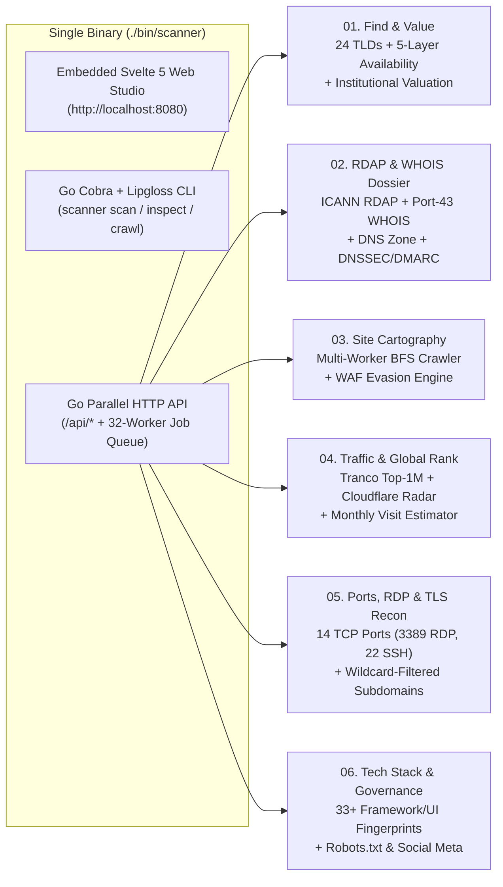

# ◈ Scanner Studio — Domain Intelligence, Valuation & Surface Reconnaissance Suite

[](./LICENSE)
[](https://go.dev/)
[](https://svelte.dev/)

**Scanner Studio** is an all-in-one domain intelligence, institutional valuation, traffic estimation, and infrastructure reconnaissance platform.

It ships as **one single self-contained binary (`./bin/scanner`)** that embeds both:
1. **The Interactive Svelte 5 Web Studio UI** (served directly at `http://localhost:8080`)
2. **The High-Concurrency Go Parallel Engine & CLI** (24-TLD availability scanner, authoritative ICANN RDAP + Port-43 WHOIS verifier, Tranco Top-1M + Cloudflare Radar traffic estimator, 14-port TCP/RDP/TLS scanner, 33-signature tech stack fingerprinter, and printable 360° PDF Domain Dossier generator).

---

## ⚡ Fastest Way to Build & Run (One Single Command)

Don't want to mess with multiple terminals or complicated build steps? Run **one single command** from the project root:

```bash
./start.sh
```

*(Or equivalently using `make`:)*

```bash
make run
```

**What this single command does automatically:**
1. Builds the Svelte 5 Web Studio bundle into `web/dist` (if `npm` is installed; otherwise uses the pre-built bundle included in the repo).
2. Embeds the entire web frontend into a **single self-contained Go executable** at `./bin/scanner` using Go's `//go:embed`.
3. Starts the server and serves **both** the Web UI and REST API at **[http://localhost:8080](http://localhost:8080)**.

---

## 📦 Build a Single Portable Binary (`./bin/scanner`)

Because `web/dist` is embedded directly into the Go binary via [`web/embed.go`](./web/embed.go), you can compile the entire application (Web UI + API Server + CLI) into **one standalone file** with zero external runtime dependencies:

```bash
# Option A: Build Frontend + Single Go Binary (if you have Go + Node.js)
make single-binary

# Option B: Go-Only Instant Build (uses the pre-built web/dist already in git — Node.js NOT required!)
go build -buildvcs=false -o bin/scanner ./cmd/scanner
```

Once built, `./bin/scanner` is a completely standalone binary. You can copy it anywhere and run:

```bash
# Launch the full Web Studio UI + API Server on http://localhost:8080
./bin/scanner serve --port 8080
```

Then open **[http://localhost:8080](http://localhost:8080)** in your browser.

---

## 🛠️ Developer Hot-Reload Mode (One Command)

If you are editing the Svelte 5 frontend in `web/src` and want live Vite HMR (`:5173`) alongside the Go API server (`:8080`), run a single command:

```bash
make dev
```

- **Svelte 5 Vite HMR Studio:** [http://localhost:5173](http://localhost:5173)
- **Go Parallel API Engine:** [http://localhost:8080](http://localhost:8080)

Press `Ctrl+C` to stop both servers cleanly.

---

## 🧭 Studio Architecture & Core Capabilities



### Primary Workbench Modes (`01` – `03`)
1. **`01. Find & Value` (24-TLD Availability & Institutional Valuation Engine)**
   - **5-Layer Availability Verification:** Parallel DNS (`NS`/`SOA`/`A`/`AAAA`/`MX`/`TXT`) + Authoritative **ICANN RDAP** + Raw TCP **Port-43 WHOIS** + **Certificate Transparency (`crt.sh`)** + **Wayback Machine CDX** so parked/squatted domains (e.g. `agent.co`) are never misclassified as unclaimed.
   - **Calibrated Market Valuation:** Evaluates TLD authority across 24 extensions, category leadership (`cloudflare.name`), 10-tier aftermarket scale (`$250k+` to `$40`), and realistic annual renewal costs.
   - **Curated Dictionary Packs:** Built-in `AI & Autonomous Agents`, `Fintech & Capital`, `Cloud & DevInfra`, `Short 3-4 Letter Roots`, and `Single-Word English Dictionary`.

2. **`02. RDAP Dossier` (Deep Registry & DNS Zone Blueprint)**
   - Queries authoritative ICANN RDAP and Port-43 WHOIS servers for exact registration creation date, age in years/days, expiration countdown, sponsoring registrar, EPP status locks, DNSSEC status, DMARC policy, and complete `NS`/`A`/`AAAA`/`MX`/`TXT`/`CNAME` records.

3. **`03. Site Tree` (Multi-Worker Hierarchical Site Cartography)**
   - Crawls live domains and sub-paths (e.g. `svelte.dev/docs/kit`) with resilient browser TLS/header profiles and WAF fallback recovery (`crt.sh` + Wayback route synthesis when blocked by Cloudflare/Vercel WAF).

### Specialized Reconnaissance Tools (Burger Menu `☰` `04` – `08`)
4. **`04. Traffic & Rank`:** Real **Tranco Top-1M** global rank, **Cloudflare Radar** rank bucket, power-law monthly visit range estimation, 7-month traffic trajectory chart, and full **Tech Stack & UI Design System** breakdown.
5. **`05. Ports & TLS`:** Probes **14 critical TCP ports** in parallel (`80`, `443`, `22` SSH, `3389` Windows RDP, `3306` MySQL, `5432` PostgreSQL, `6379` Redis, `27017` MongoDB, `8080`, `8443`, etc.), inspects TLS 1.3 cipher/SANs, and verifies live subdomains using a **Wildcard DNS Canary** to eliminate phantom subdomains.
6. **`06. Robots & Sitemap`:** Audits `robots.txt` rules across 12 Search & AI crawlers (`GPTBot`, `ClaudeBot`, `Googlebot`, `PerplexityBot`, etc.) and parses XML sitemaps.
7. **`07. Social Meta & Ads`:** Previews OpenGraph/Twitter cards across Discord, Telegram, WhatsApp, and X/Facebook, plus detects installed ad pixels and analytics beacons.
8. **`08. Saved Vault`:** Persistent JSON watchlist (`data/watchlist.json`) with 1-click parallel availability re-verification.

### 📋 360° Master Domain Report (`Queue` → `Make Report`)
- Open the **Queue (`⚡ Queue`)** drawer in the top navigation bar, enter any domain, and click **`Make Report`**.
- Dispatches all reconnaissance engines in parallel (32 Go workers) and saves a printable **8-Section PDF-Style Executive Domain Dossier** to the bottom-right **Domain Reports Dock**.

---

## 💻 Terminal CLI Reference

The same `./bin/scanner` binary provides a rich terminal interface powered by `Cobra` and `Lipgloss`:

```bash
# 1. Scan keywords & mutations across custom TLDs
./bin/scanner scan veltrix nova --tlds com,ai,io,dev,co,app,xyz,sh --mutations

# 2. Scan using a built-in curated dictionary pack
./bin/scanner scan --dict ai_agents --tlds com,ai,io,dev,co --available

# 3. Inspect a domain's authoritative RDAP registration, WHOIS, age & DNS records
./bin/scanner inspect cloudflare.com

# 4. Crawl a website or subpath and render its hierarchical URL tree in the terminal
./bin/scanner crawl svelte.dev/docs/kit --pages 20 --depth 2

# 5. Start the Single-Binary Web Studio + HTTP API Server
./bin/scanner serve --port 8080
```

---

## 🗂️ Repository Structure

```text
Scanner/
├── start.sh                 # ⚡ One-command build & run script (./start.sh)
├── Makefile                 # One-command targets: make run, make single-binary, make dev
├── LICENSE                  # MIT License
├── cmd/scanner/main.go      # Go entrypoint
├── internal/
│   ├── cli/                 # Cobra + Lipgloss terminal commands (scan, inspect, crawl, serve)
│   ├── domain/              # 24-TLD scanner, 5-layer availability verifier & valuation engine
│   ├── traffic/             # Tranco Top-1M + Cloudflare Radar + monthly traffic estimator
│   ├── recon/               # 14-port TCP/RDP scanner, TLS 1.3 auditor & wildcard DNS canary
│   ├── webintel/            # 33-signature Tech Stack detector, Robots/Sitemap & Social Meta
│   ├── crawler/             # Concurrent BFS site crawler & WAF resilience fallback
│   ├── jobs/                # Concurrent worker queue & cancellation manager
│   └── server/              # HTTP REST API + Embedded Svelte 5 SPA file server
└── web/                     # Svelte 5 + Vite + Tailwind CSS Studio
    ├── embed.go             # //go:embed all:dist for single-binary compilation
    ├── dist/                # Pre-compiled production UI bundle embedded into ./bin/scanner
    └── src/                 # Svelte 5 components, strict domain validator & API client
```

---

## 📄 License

Released under the **[MIT License](./LICENSE)**.
